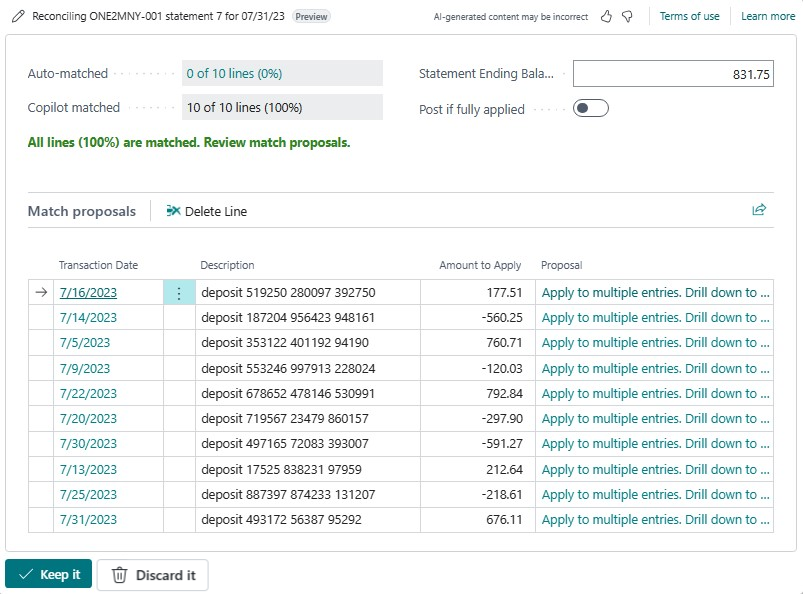
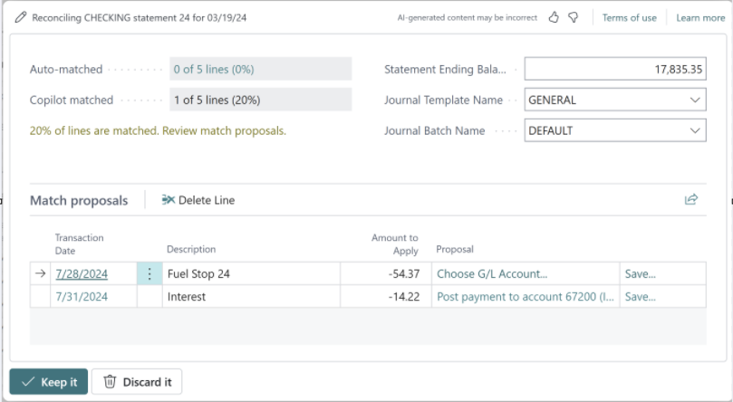

# Reconcile bank accounts with Copilot

This article explains how bank account reconciliation assist can help you reconcile bank transactions with ledger entries in Microsoft Dynamics 365 Business Central.

## About bank account reconciliation assist

Bank account reconciliation assist is a set of AI-powered features that help you reconcile bank accounts. It offers two distinct tasks through Copilot:

- Improved matching of transactions with ledger entries

    As you might already know, the **Match Automatically** button on the **Bank Acc. Reconciliation** page automatically matches most bank transactions with ledger entries. We refer to this operation as *automatch*. Although automatch works well, the algorithms that it uses can sometimes result in many unmatched transactions. Copilot uses AI technology to inspect those unmatched transactions and identify more matches, based on the dates, amounts, and descriptions. For example, if a customer paid multiple invoices in one lump sum that you have registered as individually paid invoices, Copilot reconciles the single bank statement line with the multiple bank ledger entries.

    [Learn more about this task](#reconcile-bank-accounts-with-copilot).

- Suggested general ledger (G/L) accounts

    For residual bank transactions that can't be matched to any ledger entries, Copilot compares the transaction description with G/L account names and then suggests the most likely G/L account to post to. For example, if unmatched transactions have the narrative *Fuel Stop 24*, Copilot might suggest that you post them to the *Transportation* account.

    [Learn more about this task](#post-unmatched-bank-transaction-amounts-to-suggested-gl-accounts).

## Supported languages

[!INCLUDE[copilot-language-support](includes/copilot-language-support.md)]

## Prerequisites

- The **Bank account reconciliation** capability is activated. An administrator must complete this task. Learn more in [Configure Copilot and AI capabilities](enable-ai.md).
- You're familiar with bank account reconciliation in Business Central. Learn more in [Reconcile Bank Accounts](bank-how-reconcile-bank-accounts-separately.md).

## Reconcile bank accounts with Copilot

<!-- Similar to the **Match Automatically** capability on the **Bank Acc. Reconciliation** page, Bank account reconciliation assist can also automatically matches transactions in banks statements with bank entries. The difference is that **Match Automatically** uses a native rules-based algorithm, while Bank account reconciliation assist is based AI technology though Copilot. Bank account reconciliation assist is intended to supplement the **Match Automatically** capability. While **Match Automatically** is fairly successful at matching transactions, there are some instances where it can't&mdash;which is where Bank account reconciliation assist comes. By using the **Reconcile with Copilot** action on **Bank Acc. Reconciliation** page, you can find even more matches.-->

Copilot in bank account reconciliation is intended to supplement the automatch operation. Therefore, when you use Copilot, the automatch operation runs first to make the initial matches. Then Copilot runs to try to match transactions that the automatch operation didn't handle.

You can use two approaches to reconcile bank accounts with Copilot:

- Use Copilot to start a new reconciliation on a bank account, directly from the **Bank Account Reconciliations** list.
- Use Copilot on a new or existing reconciliation on a **Bank Acc. Reconciliation** card.

# [From the Bank Account Reconciliation list](#tab/fromlist)

For this approach, you create and reconcile a new bank account reconciliation from scratch. This approach requires that you select the bank account. If the bank account isn't linked to an online account, you must also import the bank statement file.

1. Select the  icon, enter **Bank Account Reconciliations**, and then select the related link.
1. Select  **Start a Copilot prompt action** > **Reconcile** to open the **Reconcile with Copilot** window.
1. Set the **Perform reconciliation for this bank account** field to the bank account that you want to reconcile.

    

1. If the selected bank account isn't linked to an online bank account, you must import the bank statement file. To import the file, either select the value in the **Use transaction data from** field or select the paper clip button next to the **Generate** button. Then use **Select the file to import** to import the bank statement file by either dragging it from your device or browsing your device.
1. To reconcile with Copilot, select **Generate**.

    Copilot starts to generate proposed matches. When it finishes, the **Reconcile with Copilot** window shows the results of the matching process.

1. Review the proposed matches as described in the next section.

# [From a Bank Acc. Reconciliation card](#tab/fromcard)

For this approach, you use Copilot either on a new bank account reconciliation that you manually create or by editing an existing reconciliation.

1. Select the  icon, enter **Bank Account Reconciliations**, and then select the related link.
1. Follow one of these steps:

    - Select **New** to start a new reconciliation. Add the statement lines, either manually or by using **Suggest Lines** action to get a copy of the bank ledger entries as a starting point.
    - Select and open an existing reconciliation in the list.

1. On the **Bank Acc. Reconciliation** card, select  > **Reconcile with Copilot** in the upper-right corner.

    

    Copilot starts to generate proposed matches. When it finishes, the **Reconcile with Copilot** window shows the results of the matching process.

1. Review the proposed matches as described in the next section.
---

### Review, save, or discard proposed matches

After you run Copilot, the **Reconcile with Copilot** window shows the detailed results, including any proposed matches. At this point, no match that Copilot proposed has been saved. Therefore, you have an opportunity to inspect the proposals and save or discard them as you want.

The **Reconcile with Copilot** window is divided into two sections. The upper section provides some general details about the result. The lower section, **Match proposals**, lists the matches that Copilot proposed.

The following table describes the fields in the upper section.

| Field | Description |
|---|---|
| Auto-matched | The number of bank statement lines that the automatch operation matched. Select the value to view the reconciliation card. |
| Copilot matched | The number of bank statement lines that Copilot proposed matches for. You can view details of the matches in the **Match proposals** section. |
| Statement Ending Balance | The ending balance that is shown on the bank statement that you're reconciling with. |
| Post if fully applied | Turn on this option to automatically post the bank account reconciliation when all lines (100 percent) are matched and you select **Keep it**. |

In the **Match proposals** section, review the proposed matches line by line. Then take the appropriate action:

- To discard a single proposed match, select it in the list, and then select **Delete Line**.
- To discard all proposed matches and close the **Reconcile with Copilot** window, select the  **Discard it** button next to the **Keep it** button at the bottom of the window.
- To automatically post the fully matched reconciliation when you save it, turn on the **Post if fully applied** option.
- To save the matches that are currently shown in the **Reconcile with Copilot** window, select **Keep it**.

## Post unmatched bank transaction amounts to suggested G/L accounts

This section explains how to use Copilot to post unreconciled bank account statement line amounts (as specified in the **Difference** field) to a G/L account. This task can be done only from an existing reconciliation.

1. Go to the **Bank Account Reconciliations** list, and open the existing reconciliation that includes the unreconciled lines.

    This step gives you a clear view of any unreconciled bank statement lines that must be transferred to the G/L account.

1. In the **Bank statement lines** pane, identify the unmatched bank statement lines, and select one or more lines that you want to reconcile.

    Copilot focuses on the selected lines to post new payments to the G/L account.

1. Select  > **Post Difference to G/L Account** to start the process.

    

    Copilot starts to generate proposals for posting new payments.

1. After Copilot finishes generating proposals, the **Copilot Proposals for Posting Differences to G/L Accounts** window appears.

    The **Match proposals** section of this window shows the proposals. The experience resembles the experience for reconciling with Copilot.

    

    To post the differences as regular journal entries, you must specify the general journal template and batch to use. This allows you to reverse the transaction if you need to later.

1. Review the proposals line by line to ensure the accuracy of the suggested payments for posting.

    - If you drill down on the proposal by selecting it in the list, you're taken to a list of accounts. From there, you can select another account. You can do this type of manual correction only when you use the **Post Difference to G/L Account** flow, not the matching flow.
    - If you select **Save** next to a proposal, you can add the mapping to the **Text-to-Account Mapping** page. Then, the next time that this text appears during matching, it's mapped to the proposed account.

1. Discard or save proposals.

    - To discard a specific proposal, select it in the list, and then select **Delete Line**. To discard all proposals and close Copilot, select the  **Discard it** button next to the **Keep it** button at the bottom of the window.
    - If the proposals meet your requirements, and you want to save them, select **Keep it**.

         This step confirms the transfer of the currently selected proposals from the bank account ledger to the G/L account. It posts new payments to the proposed G/L accounts and applies corresponding lines to the resulting bank account ledger entries.

## Next steps

[Validate your bank account reconciliation](bank-how-reconcile-bank-accounts-separately.md#validate-your-bank-reconciliation)

## See also

[Troubleshoot Copilot and AI capabilities](ai-copilot-troubleshooting.md)  
[Responsible AI FAQ for bank reconciliation assist](faqs-bank-reconciliation.md)  
[Setting Up Banking](bank-setup-banking.md)  
[Reconcile Bank Accounts](bank-how-reconcile-bank-accounts-separately.md)  
[Applying Payments Automatically and Reconciling Bank Accounts](receivables-apply-payments-auto-reconcile-bank-accounts.md)
