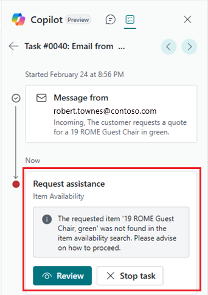

# Item availability in Sales Order Agent (preview)

[!INCLUDE [preview-banner](~/../shared-content/shared/preview-includes/preview-banner.md)]

The **Item Availability** page is part of the Sales Order Agent for checking item availability during the sale order taking process. This article provides a detailed overview of how the **Item Availability** page functions, including configuration and field descriptions.

[!INCLUDE [limited-public-preview](includes/limited-public-preview.md)]

## Overview

Admins can set up the Sales Order Agent to select only available items for sales quotes or orders. Learn more in [Set up Sales Order Agent (preview)](sales-order-agent-setup.md).

When this capability is turned on, the Sales Order Agent uses the **Item Availability** page to check an item's availability before adding it the quote or order. If an item isn't available, reviewers are notified by a **Request Assistance** step in the timeline for the task in **Task** tab.

As a reviewer, you use the **Item Availability** page to verify that items are unavailable and then decide whether you want to stop the task or you want agent to proceed. You can't use it to change itemsand quantity at this point but if you confirm the step, the agent creates an email to the customer about the unavailable items for your review.

As a reviewer, use the **Item Availability** page to verify that items are unavailable. Decide whether to stop the task or let the agent proceed. You can't change items and quantity at this point. If you confirm the step, the agent creates an email to the customer about the unavailable items for your review.

<!--
Here's the general flow:

1. Select **Review** or the **Item Availability** link to open the **Item Availability** page.
1. Verify that the items in question are unavailable. Refer to the next section for details about how the page works.
1. When you're finished reviewing availability, return to the confirmation step in the **Tasks** tab and select **Confirm**.

The agent creates an email about the unavailable items for your review.
-->

## How to check item availability page

Before the agent calculates the availability and prices for requested items, its searches for the customer making the request, retrieves the customer's specific location, and then sets the **Customer No.** and **Location Filter** fields on the **Item Availability** page.

After setting these fields, the agent checks the availability of each item in the request one at a time. The agent sets the **Date filter** with the customer's requested delivery date, if any, and the **Quantity Filter** to the requested quantity, currently only in the base unit of measure. 

As a reviewer, the **Customer No.** and **Location Filter** values that the agent used aren't shown in the Sales Order Agent timeline or on the **Item Availability** page. The check the availbility set set these fields manually. 
The total amount of the (compressed) data stored in the environment database. The amount includes size of keys/indexes and blob data.
The total amount of compressed data stored in the environment database, including the size of keys, indexes, and blob data.

For each item, the following fields are calculated:

|Field|Description|
|-|-|
|Requested Quantity Available|Indicates whether the quantity of items requested by the customer, specified by the **Quantity Filter** field, is available. If the **Quantity Filter** is less than or equal to the **Available Quantity (Base UOM)**, the item is available, and the check box is selected. If the **Quantity Filter** field is greater than item isn't available, and the check box is cleared. |
|Available Quantity (Base UOM)|Shows the projected available balance of item quantity on the date specified by the **Date Filter**. Calculate the value by adding the current item inventory in ledger entries to the items in scheduled receipts (inbound transactions like purchase and transfer orders). Then, subtract the items in gross requirements (outbound transactions like sales, service, and production orders). You can select the value to display the totals for item ledger entries and each receipt type. Then, you can drill down to view the source of these totals.|
|Unit of Measure Code|Shows the item's sales unit of measure code. If the field is empty, the base unit of measure is used.|
|Unit of Measure|The item's sales or base unit of measure description. Learn more in [Set Up Units of Measure](inventory-how-setup-units-of-measure.md).|
|Available Quantity|Shows the available quantity in base unit of measure (UOM) recalculated to the sales unit of measure.|
|Unit Price Including Discount|Shows the items' price including discount calculated for a specified customer on a specified date. Learn more in [Record special sales prices and discounts](sales-how-record-sales-price-discount-payment-agreements.md).|
|Availability Level|Shows the level of the item's availability, such as ***Available** or **Out of Stock**. The value is calculated based on the **Available Quantity (Base UOM)** compared to the **Safety Stock  Quantity** specified on the item or storekeeping unit card. Learn more about safety stock in [Design Details: Balancing supply and demand](design-details-balancing-demand-and-supply.md).|

## Related information

[Sales order agent overview](sales-order-agent.md)  
[Set up the Sales Order Agent](sales-order-agent-setup.md)  
[FAQ for Sales Order Agent](faqs-sales-order-taker-agent.md)  
[Configure Copilot and AI capabilities](enable-ai.md)  
